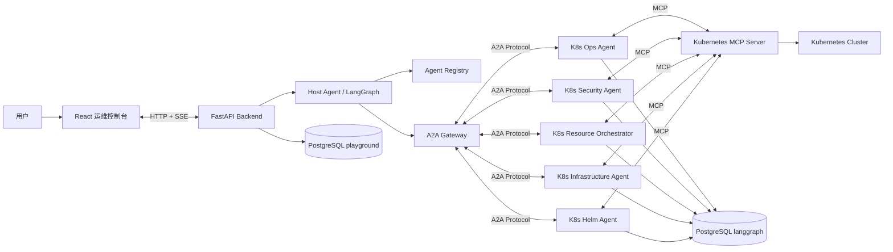
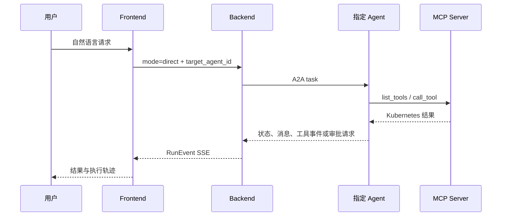
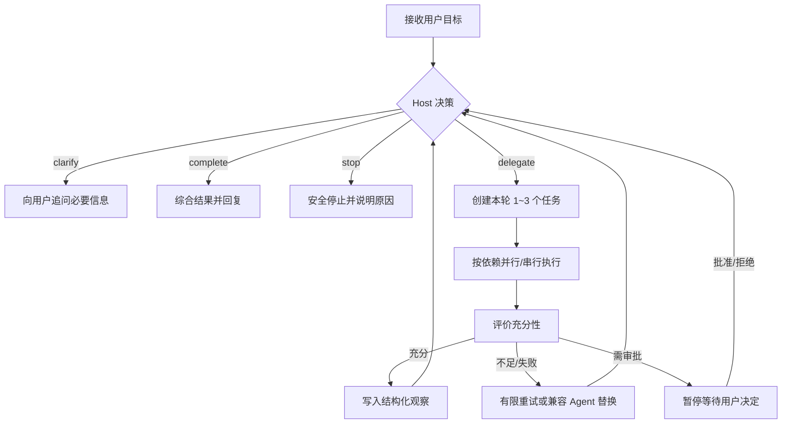

# A2A Kubernetes 智能多 Agent 平台设计与技术实现

> 文档状态：当前实现说明  
> 适用对象：技术评审、架构师、研发人员、运维与平台工程团队  
> 代码基线：以本仓库当前代码、`docker-compose.yml` 和 Agent 配置为准

## 1. 项目概述

A2A Playground 是一个面向 Kubernetes 运维、诊断、安全审计和资源变更场景的
智能多 Agent 平台。它通过大模型理解用户的自然语言目标，由 Host Agent 规划任务，
再通过 A2A 协议将任务交给不同领域的 Kubernetes Agent。各专业 Agent 使用 MCP
协议发现并调用 Kubernetes 工具，最终由 Host 汇总证据并生成面向用户的答案。

项目不是让一个大模型直接拥有整个集群的无限权限，而是将智能推理与实际执行拆成
多个可验证边界：

1. **大模型负责理解与决策**：理解目标、拆解任务、选择 Agent、选择工具、评价结果。
2. **A2A 负责 Agent 间协作**：统一 Agent 发现、任务委派、上下文延续和状态传递。
3. **MCP 负责工具接入**：将 Kubernetes 查询与变更能力转换为标准化工具。
4. **确定性策略负责安全**：工具白名单、默认拒绝、写操作审批不由提示词决定。
5. **PostgreSQL 负责事实留存**：持久化业务历史、执行事件和 Agent checkpoint。
6. **可视化控制台负责人机协作**：展示计划、任务、工具调用、审批和最终结果。

### 1.1 核心价值

- 用户可以使用自然语言完成 Kubernetes 状态查询、故障定位、安全审计和受控变更。
- Host 能够根据实时结果进行多轮决策，而不是执行固定脚本或关键词路由。
- 多个 Agent 按领域隔离能力和权限，降低单一超级 Agent 的安全风险。
- 所有写操作必须经过显式审批，审批对象绑定工具、参数和摘要。
- 执行过程通过统一事件流实时展示，并可在断线后从持久化事件继续恢复。
- Agent、模型和 Kubernetes MCP 服务相互解耦，可以独立部署和替换。

## 2. A2A、MCP 与大模型的协同关系

这是整个系统最重要的设计主线。

| 层次 | 核心职责 | 当前技术实现 |
|---|---|---|
| 用户交互层 | 接收目标、展示推理过程和审批操作 | React、Ant Design、SSE |
| Host 智能编排层 | 规划、追问、委派、评价、重试、综合 | LangGraph、结构化大模型输出 |
| Agent 协作层 | Agent Card 发现、A2A 任务与上下文传递 | `a2a-sdk==0.3.25` |
| 专业 Agent 推理层 | 理解领域任务、选择工具、整理证据 | LangGraph ReAct、OpenAI-compatible LLM |
| MCP 工具层 | 发现并调用 Kubernetes 工具 | MCP Streamable HTTP / HTTP+SSE |
| 安全控制层 | allow/deny/approval、摘要校验、预算限制 | 共享 Agent Runtime 的确定性策略 |
| 数据与恢复层 | 业务历史、事件、审批、checkpoint | PostgreSQL、SQLAlchemy、Alembic |

### 2.1 A2A 解决什么问题

A2A 是 Host 与专业 Agent 之间的协作协议边界。Host 不需要知道每个 Agent 内部使用
哪一种模型、LangGraph 图或 MCP 客户端，只需要读取 Agent Card 并按标准协议发送任务。

项目中的 A2A 主要承担：

- 通过 Agent Card 暴露 Agent 名称、技能、输入输出模式和服务地址；
- 通过稳定 Agent ID 进行路由，避免依赖展示名称；
- 将用户目标和上游 Agent 证据委派给目标 Agent；
- 保存并复用 A2A `context_id` 和 `task_id`，支持连续对话；
- 传递 working、completed、failed、input-required 等任务状态；
- 将工具活动、产物和待审批动作传回 Backend；
- 支持外部 A2A Agent 在运行时注册，而不要求与 Backend 一起部署。

### 2.2 MCP 解决什么问题

MCP 是专业 Agent 与 Kubernetes 能力之间的工具协议边界。Agent 启动或执行时从 MCP
Server 获取工具定义，将 JSON Schema 转换为大模型可以调用的结构化工具，然后通过
MCP 会话执行具体操作。

共享 Runtime 当前支持：

- Streamable HTTP 和传统 HTTP+SSE 两种传输方式；
- MCP 工具动态发现；
- JSON Schema 到 Pydantic/LangChain 工具参数模型的转换；
- 工具调用超时和一次传输错误重试；
- MCP 返回内容的统一文本化；
- 每个任务的工具调用预算和软阈值提醒；
- 在工具执行前应用确定性的权限策略。

### 2.3 大模型承担什么职责

系统使用两层大模型推理：

**Host 大模型**负责全局任务：

- 判断直接回答、澄清、委派或停止；
- 根据 Agent Card 和能力标签选择 Agent；
- 创建带依赖关系、风险等级和完成标准的任务；
- 决定同一轮可以并行执行的任务；
- 评价 Agent 结果是否充分；
- 对失败或证据不足的任务进行有限重试或替换；
- 在所有终态结果基础上生成最终总结。

**专业 Agent 大模型**负责领域任务：

- 理解 Host 下发的具体目标；
- 在自身允许的 MCP 工具集合中选择工具；
- 根据 Kubernetes 返回结果继续查询或停止；
- 将发现、资源、证据、建议和限制组织成结果；
- 遇到写工具时生成待审批动作，而不是直接执行。

大模型的输出必须经过 Pydantic 模型和确定性校验。模型负责提出决策，但不能自行扩大
Agent 权限、绕过审批或伪造执行成功。

## 3. 总体架构



### 3.1 组件职责

#### Frontend

- 提供 Dashboard、Agent 管理、统一 Workspace、任务浏览、事件查看和模型配置页面；
- 支持 Direct 和 Auto 两种运行模式；
- 使用 SSE 接收统一的版本化 RunEvent；
- 将 Host、Agent、工具和审批活动展示为执行轨迹；
- 在断线后使用 `run_id` 与事件序号补拉并继续订阅；
- 对敏感字段进行展示侧脱敏，并为审批提供参数差异视图。

#### Backend / Host

- 暴露 Agent、会话、运行、事件、审批和模型设置 API；
- 管理 Agent Registry 和健康状态；
- 负责 Direct 与 Auto 两类 Run 的生命周期；
- 使用 Host 大模型产生结构化决策；
- 通过 A2A Gateway 调用专业 Agent；
- 保存消息、任务、审批、Artifact 和有序事件；
- 在 Backend 重启后将未完成 Run 标记为 interrupted，避免伪造完成状态。

#### Shared Agent Runtime

五个 Kubernetes Agent 共享同一套 Runtime，统一实现：

- A2A Server 和 Agent Card；
- LangGraph Agent 生命周期；
- MCP 连接、工具发现和工具调用；
- 工具 Schema 适配；
- 权限策略与审批中断；
- 工具调用预算、超时和结果流；
- PostgreSQL checkpoint；
- readiness 健康检查。

#### PostgreSQL

一个 PostgreSQL 实例承载两个逻辑数据库：

- `playground`：Agent 注册信息、会话、消息、Run、任务、事件、远端绑定、审批、Artifact 和运行时设置；
- `langgraph`：专业 Agent 的 LangGraph checkpoint，用于恢复同一上下文的 Agent 状态。

当前运行时不提供 SQLite 或内存 checkpoint 回退，避免系统表面上可恢复而实际丢失状态。

## 4. 两种执行模式

### 4.1 Direct 模式

用户明确选择一个 Agent，Backend 不经过 Host 规划，直接通过 A2A 调用目标 Agent。



Direct 模式适用于用户已经知道需要哪个专业 Agent 的场景，例如直接查询 Pod 日志、
执行安全审计或管理 Helm release。

### 4.2 Auto 模式

Auto 模式由 Host 持续做“观察—决策—执行—评价”的多轮编排。



Host 决策使用结构化模型约束：

- `delegate`：本轮创建 1～3 个相互独立的任务；
- `clarify`：只有缺少会实质改变执行方式的信息时才追问；
- `complete`：目标满足且必要变更已验证后完成；
- `stop`：继续执行不安全或不可能时停止。

任务包含目标 Agent、目标、输入、依赖、完成标准、读写风险、所需技能、标签、工作流角色
和最大尝试次数。后端会再次验证 Agent 是否存在、技能是否匹配、依赖是否有效、只读 Agent
是否被错误分配写任务等条件。

## 5. Kubernetes 专业 Agent 设计

仓库当前包含五个基础能力 Agent。默认 Compose 启动前三个核心 Agent；Infrastructure
和 Helm Agent 可独立启动，也可以作为外部 A2A 服务注册。

### 5.1 K8s Ops Agent

**定位**：只读运维诊断、资源观察、日志与事件分析。

**典型能力**：

- 查询 Namespace、Pod、Deployment、Service、Node 等 Kubernetes 资源；
- 获取资源详情和运行状态；
- 查询 Pod 日志、事件、关联服务、端点、存储和环境来源；
- 查看节点和 Pod 的资源使用情况；
- 检查命名空间或工作负载健康状况；
- 在变更后验证资源是否真正生效并恢复健康。

**工具策略**：允许 `list_k8s_*`、`get_k8s_*`、`get_pod_*`、
`describe_k8s_*` 以及只读文件列表工具；未声明工具默认拒绝。

**智能化重点**：Agent 可以根据初始现象逐步扩大或收敛证据链，例如从异常 Pod
继续查询事件、日志、Service 和资源压力，最后生成带证据的诊断结论，而不是只返回一条命令结果。

### 5.2 K8s Security Agent

**定位**：只读 Kubernetes 安全评估和变更前安全检查。

**典型能力**：

- 检查特权容器、HostPath、HostNetwork 等工作负载风险；
- 分析 RBAC、ServiceAccount 和权限暴露；
- 检查镜像、NetworkPolicy 和资源配置风险；
- 在资源变更前提供 Security precheck；
- 输出发现、证据、风险说明和整改建议。

**工具策略**：仅开放安全审计所需的资源、事件和关联信息查询；显式拒绝可能泄露
敏感环境变量值的 `get_k8s_pod_linked_env`。

**智能化重点**：Host 对 Kubernetes 写操作设置了工作流护栏——写任务之前必须先取得
成功的安全预检查观察，不能用普通资源查询代替安全审计。

### 5.3 K8s Resource Orchestrator Agent

**定位**：创建、修改、扩缩容和删除 Kubernetes 资源。

**典型能力**：

- 生成并应用 Kubernetes YAML；
- Patch、Label、Annotate 和删除资源；
- Deployment 扩缩容、重启、暂停、恢复和回滚；
- 更新镜像版本；
- 执行 Pod 内命令和文件上传/删除；
- 根据 GPU 或大模型场景生成资源模板；
- 在变更前读取现有资源，在审批后执行精确变更。

**写操作策略**：下列类别不会自动执行，必须生成审批：

- `apply_k8s_yaml`、`patch_k8s_resource`；
- 资源、YAML、Pod 删除；
- Pod exec 和文件操作；
- Deployment/DaemonSet 重启、扩缩容、停止、恢复、暂停、继续和回滚；
- 镜像、标签和注解修改。

**智能化重点**：Agent 负责把用户意图转换为精确工具参数，但实际写调用由审批状态机控制。
对于需要删除重建的不可变 Pod 变更，每一个写动作都必须分别经过正式审批。

### 5.4 K8s Infrastructure Agent

**定位**：节点维护、基础设施类资源和多集群注册管理。

**典型能力**：

- 查询节点、节点 IP 和资源使用情况；
- 查询节点上运行的 Pod 数量；
- Cordon、Drain、Taint、Uncordon 和 Untaint 节点；
- 查看 StorageClass 对应的 PV/PVC 使用情况；
- 设置默认 StorageClass 或 IngressClass；
- 查询、注册和注销 Kubernetes 集群。

**安全策略**：节点维护、默认类切换和集群注册变更全部需要审批。只读容量和使用情况
查询可以自动执行。

### 5.5 K8s Helm Agent

**定位**：Helm release 生命周期管理。

**典型能力**：

- 查询 Helm release；
- 获取安装前所需的 Namespace 和 Kubernetes 资源信息；
- 安装 Helm Chart；
- 卸载 Helm release。

**安全策略**：查询自动执行，安装与卸载必须审批。

### 5.6 Agent 能力对照

| Agent | 主要关注对象 | 自动能力 | 审批能力 | 默认风险级别 |
|---|---|---|---|---|
| Ops | Pod、日志、事件、资源状态 | 查询与诊断 | 无 | read-only |
| Security | 工作负载、RBAC、网络、镜像 | 安全审计 | 无 | read-only |
| Orchestrator | Kubernetes 业务资源 | 查询与模板 | 应用、修改、删除、执行 | write-approval |
| Infrastructure | Node、Class、Cluster Registry | 使用情况查询 | 节点维护、默认类、集群注册 | write-approval |
| Helm | Chart 与 Release | 查询 release | 安装、卸载 | write-approval |

## 6. 典型智能化工作流

### 6.1 故障诊断

用户：“为什么 `production` 里的订单服务一直重启？”

1. Host 识别为运维诊断任务并委派给 Ops Agent。
2. Ops Agent 通过 MCP 查询 Pod 状态、重启次数、事件和日志。
3. Agent 根据初始证据继续查询资源限制、探针或关联配置。
4. Host 评价证据是否满足完成标准。
5. 最终答复区分已观察事实、根因推断、影响范围和建议操作。

### 6.2 安全检查后执行变更

用户：“把支付服务扩到 6 个副本，并确认它正常。”

1. Host 先委派 Security Agent 做变更前检查。
2. 安全检查通过后，下一轮委派 Orchestrator 执行扩容。
3. Orchestrator 调用写工具时返回 `approval_required`。
4. Frontend 展示工具名、参数、目标和摘要，等待用户批准。
5. 批准后恢复原 Agent 上下文，执行完全一致的工具调用。
6. 变更成功后，Host 再单独委派 Ops Agent 验证副本和健康状态。
7. Host 只有获得执行与验证证据后才声明完成。

这个流程体现了系统的核心安全顺序：

```text
Security precheck → Mutation approval → Exact execution → Ops verification
```

### 6.3 多方向并行调查

用户：“检查集群为什么变慢，同时看看是否存在安全风险。”

Host 可以在同一轮并行创建：

- Ops 任务：检查节点压力、Pod 资源使用、异常事件和服务健康；
- Security 任务：检查高风险配置、RBAC 和 NetworkPolicy。

两条分支互不依赖时并行执行，Host 保留各自证据后统一总结，降低串行查询带来的延迟。

### 6.4 Helm 发布管理

用户可以要求查询现有 release、评估安装目标、准备 Chart 参数，并在确认后安装或卸载。
Helm Agent 负责领域推理，审批系统确保 release 变更不会因模型自行决定而执行。

## 7. 审批与安全设计

### 7.1 默认拒绝

每个 Agent 在 YAML 中独立声明：

- `allow`：允许自动执行；
- `approval_required`：必须暂停并等待审批；
- `deny`：显式禁止；
- 未匹配：默认拒绝。

权限判定由 Python Runtime 执行，不依赖 Prompt。即使模型要求调用未授权工具，工具也不会
被暴露或执行。

### 7.2 审批绑定

待审批动作包含：

- approval ID；
- Agent ID；
- MCP 工具名；
- 完整参数；
- 请求原因；
- action digest。

审批记录持久化在 PostgreSQL 中。重复审批通过原子 claim 避免重复执行；参数发生变化时，
原摘要不再代表新动作，必须创建新的审批。

### 7.3 敏感信息保护

A2A Gateway 和前端展示会对 authorization、cookie、kubeconfig、password、private key、
secret、token、API key 等字段进行脱敏。外部 Agent 注册还会校验 URL scheme、主机名和
解析地址，默认阻止私网、回环、链路本地等地址；可信本地开发环境可显式开启私网 Agent。

### 7.4 防止大模型越权

- Host 只能通过 A2A 调用 Agent，不能直接调用 Kubernetes MCP；
- 只读 Agent 不能被合法计划分配写任务；
- mutation 前必须存在 Security precheck；
- mutation 和 verification 不能在同一轮假设性并行；
- 没有执行证据时 Host 不得宣称操作成功；
- 不完整验证不能作为再次修改资源的依据；
- 每个任务与工具调用都有数量和超时限制。

## 8. 数据模型与持久化

### 8.1 业务数据

`playground` 数据库包含：

| 表/实体 | 用途 |
|---|---|
| agents | 已注册 Agent 的 Card、URL、能力和风险信息 |
| conversations | Direct/Auto 会话及统计信息 |
| messages | 用户、Host 和 Agent 消息 |
| orchestration_runs | 一次统一运行的状态与 Host 状态 |
| orchestration_tasks | 任务树、Agent、依赖、尝试和状态 |
| events | 普通事件和版本化 RunEvent |
| remote_task_bindings | 本地 Run 与远端 A2A context/task 的绑定 |
| approvals | 工具、参数摘要、决策和执行状态 |
| artifacts | Agent 产生的结构化产物 |
| runtime_settings | Host 模型等运行时配置 |

RunEvent 使用 `(run_id, sequence)` 唯一索引。写入事件前对 Run 获取 PostgreSQL advisory
transaction lock，在一个事务中计算并写入下一个序号，从而保持同一 Run 的事件顺序。

### 8.2 Agent checkpoint

专业 Agent 使用 `AsyncPostgresSaver` 将 LangGraph 状态保存到 `langgraph` 数据库。
A2A `context_id` 映射为 LangGraph `thread_id`，使同一 Agent 可以在后续消息或审批恢复时
读取原上下文。不同 Agent 的上下文包含 Agent 标识，避免意外共享 Graph 状态。

### 8.3 事件驱动的前端恢复

Frontend 按 `sequence` 消费 RunEvent，并在本地 reducer 中构建：

- Run 状态；
- Host 决策轮次；
- Agent 任务树；
- 工具调用生命周期；
- 消息和流式增量；
- 审批和 Artifact；
- 失败、取消和重试状态。

SSE 断开后，客户端先调用事件查询接口补齐 `after_sequence` 之后的持久化事件，再恢复实时流，
因此重连不会创建新的 Run，也不会仅依赖浏览器内存。

## 9. 统一事件模型与可观测性

系统定义版本化 `RunEvent`，主要事件包括：

- Run：started、completed、failed、cancelled；
- Host：planning、round started/completed、decision、plan、synthesis；
- Task：delegated、started、context prepared、retry、evaluated、blocked、completed、failed；
- Message：delta、completed；
- Tool：called、completed；
- Approval：required、decided；
- Artifact：created。

这套事件模型让用户能够回答：

- Host 为什么选择这个 Agent？
- 哪些任务并行，哪些任务有依赖？
- Agent 调用了什么工具，耗时多久？
- 哪一步失败、重试或被阻塞？
- 写操作为什么需要审批，最终是否实际执行？
- 最终答案引用了哪些 Agent 结果？

## 10. 前端设计

统一 Workspace 采用“会话—对话—执行轨迹”三部分布局：

```text
会话列表 | 用户、Host 与 Agent 消息 | Host→Agent→Tool 轨迹与审批
```

主要交互能力包括：

- Direct/Auto 模式选择；
- Agent 在线和依赖就绪状态；
- 会话创建、恢复、重命名和删除；
- Markdown、表格和代码内容展示；
- Host 决策轮次与并行任务时间线；
- 工具参数、结果、错误和耗时详情；
- 审批风险、参数差异与批准/拒绝操作；
- Run 取消、重试、断线重连和事件调试；
- Dashboard、Tasks 和 Events 多维度检索。

前端不是简单聊天窗口，而是一个面向智能 Agent 的可观测运维控制台。

## 11. 部署架构

默认 Docker Compose 启动：

- PostgreSQL 16；
- Backend migration；
- Agent checkpoint migration；
- K8s Orchestrator、Ops、Security 三个核心 Agent；
- FastAPI Backend；
- React/Nginx Frontend。

核心启动依赖顺序：

```text
PostgreSQL healthy
  ├─ backend-migrate completed → Backend
  └─ checkpoint-migrate completed → Core Agents
Backend healthy → Frontend
```

Backend 与 Agent 在业务上解耦：Backend 即使暂时没有可用 Agent 也能启动并管理历史数据；
Agent 可以在之后注册或恢复。Infrastructure 和 Helm 当前不在默认 Compose 服务中，可手动部署。

## 12. 技术栈

| 范畴 | 技术 |
|---|---|
| Frontend | React 18、Ant Design 6、React Router、Vite |
| Backend API | Python、FastAPI、Uvicorn、Pydantic 2 |
| Agent 协议 | A2A SDK 0.3.25 |
| Agent 编排 | LangGraph、LangChain |
| 模型接入 | OpenAI-compatible API、DeepSeek 或兼容服务 |
| 工具协议 | MCP、Streamable HTTP、HTTP+SSE |
| 数据库 | PostgreSQL 16、SQLAlchemy Core、Alembic、psycopg 3 |
| Checkpoint | LangGraph AsyncPostgresSaver |
| 实时通信 | Server-Sent Events |
| 部署 | Docker、Docker Compose、Nginx |
| 测试 | pytest、Node Test Runner、前端生产构建 |

## 13. 代码实现索引

| 模块 | 关键路径 |
|---|---|
| FastAPI 入口 | [`backend/main.py`](../backend/main.py) |
| Run API 与审批 API | [`backend/api/runs.py`](../backend/api/runs.py) |
| Run 生命周期 | [`backend/orchestration/service.py`](../backend/orchestration/service.py) |
| Direct/Auto 策略 | [`backend/orchestration/strategies.py`](../backend/orchestration/strategies.py) |
| Host 决策模型 | [`backend/host/orchestration/models.py`](../backend/host/orchestration/models.py) |
| Host 大模型决策 | [`backend/host/langgraph/decisions.py`](../backend/host/langgraph/decisions.py) |
| 计划确定性校验 | [`backend/host/orchestration/validation.py`](../backend/host/orchestration/validation.py) |
| A2A Gateway | [`backend/a2a_gateway.py`](../backend/a2a_gateway.py) |
| A2A SDK Client | [`backend/a2a_client.py`](../backend/a2a_client.py) |
| 审批服务 | [`backend/approvals/service.py`](../backend/approvals/service.py) |
| PostgreSQL Repository | [`backend/persistence/repository.py`](../backend/persistence/repository.py) |
| RunEvent 模型 | [`backend/orchestration/events.py`](../backend/orchestration/events.py) |
| Agent Runtime | [`agents/shared-runtime/a2a_runtime/agent.py`](../agents/shared-runtime/a2a_runtime/agent.py) |
| MCP Client | [`agents/shared-runtime/a2a_runtime/mcp_client.py`](../agents/shared-runtime/a2a_runtime/mcp_client.py) |
| MCP 工具适配 | [`agents/shared-runtime/a2a_runtime/tool_adapter.py`](../agents/shared-runtime/a2a_runtime/tool_adapter.py) |
| 工具策略 | [`agents/shared-runtime/a2a_runtime/tool_policy.py`](../agents/shared-runtime/a2a_runtime/tool_policy.py) |
| Agent 配置 | [`agents/`](../agents/) 下各 `agent.yaml` |
| 前端运行状态 | [`frontend/src/state/runEvents.js`](../frontend/src/state/runEvents.js) |
| SSE 客户端 | [`frontend/src/api/runStream.js`](../frontend/src/api/runStream.js) |
| 统一 Workspace | [`frontend/src/pages/WorkspacePage.jsx`](../frontend/src/pages/WorkspacePage.jsx) |

## 14. 当前边界

文档描述的是当前已经落地的主体架构，同时系统仍有以下工程边界：

- 默认 Compose 只包含三个核心 Agent，Infrastructure 和 Helm 需要额外部署；
- Run 执行和 SSE 唤醒包含进程内状态，当前更适合单 Backend worker；
- MCP 工具权限主要基于工具名分类，集群、Namespace 和资源范围的参数级授权仍可增强；
- `PLAYGROUND_API_KEY` 是共享 Bearer Token，不等同于企业用户、角色和租户体系；
- 外部 LLM、MCP 和 Kubernetes 的可用性仍决定真实执行效果；
- 自动化结论必须以实际工具证据为准，不能把模型推断当成集群事实。

## 15. 后续演进方向

### 15.1 更细粒度安全控制

- 按用户、角色、集群、Namespace 和资源类型授权；
- 对 Pod exec、文件路径、镜像仓库和高危命令增加参数级策略；
- 审批有效期、资源版本和执行前状态重新校验；
- 接入企业身份、审计和策略引擎。

### 15.2 分布式运行能力

- 将 Run 执行移入独立 Worker；
- 使用消息队列或 PostgreSQL LISTEN/NOTIFY 分发状态；
- 支持多个 Backend 副本、跨实例取消和审批恢复；
- 增加指标、Tracing、告警和容量管理。

### 15.3 更强的 Agent 智能

- 基于历史成功案例检索相似诊断路径；
- 对工具结果做结构化证据抽取和置信度评估；
- 引入面向 Kubernetes 对象关系的上下文压缩；
- 支持巡检、告警响应和变更验证等可配置场景 Agent；
- 建立离线评测集，衡量规划正确率、工具选择、结论真实性和安全违规率。

### 15.4 更完整的 Kubernetes 闭环

- GitOps 变更提案与 Pull Request 审批；
- 变更前 dry-run、diff 和策略检查；
- 变更后的 SLO、事件和回滚条件验证；
- 多集群拓扑、环境分层和跨集群对比；
- Helm、资源编排、节点维护与安全策略的组合工作流。

## 16. 总结

A2A Playground 的核心并不是“用大模型操作 Kubernetes”，而是构建一套可拆分、可观察、
可审批、可恢复的智能运维架构：

- **A2A** 让 Host 与专业 Agent 标准化协作并保持服务解耦；
- **MCP** 将 Kubernetes 能力转换为模型可发现、系统可控制的工具；
- **大模型** 提供目标理解、动态规划、工具选择、结果评价和自然语言综合；
- **确定性策略与审批** 确保智能决策不能越过安全边界；
- **PostgreSQL 与事件流** 让每次运行能够追踪、回放和恢复；
- **五类 Kubernetes Agent** 将诊断、安全、资源、基础设施和 Helm 能力按职责隔离。

最终形成的是一个以自然语言为入口、以证据和审批为约束、以多 Agent 协作为执行方式的
Kubernetes 智能操作平台。
