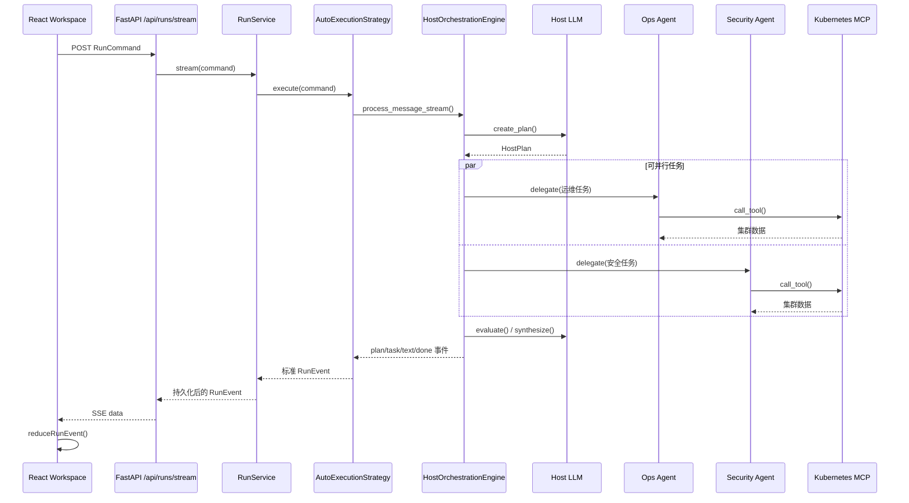

# A2A Playground 前后端代码中文导读

> 这不是设计文档，而是一份“顺着代码运行路径阅读”的说明。目标是让你能回答：用户点击发送以后，代码依次进入哪些函数；Host 如何拆任务；两个 Agent 如何并行；结果如何变成页面右侧的任务卡片；发生错误时应该看哪里。

## 1. 先建立整体认识

这个项目实际包含三类进程：

1. **React 前端**：接收用户输入，连接 SSE，保存页面状态，展示消息和任务轨迹。
2. **Playground 后端**：管理会话和 Run，调用 Host，持久化事件，把事件通过 SSE 推送给前端。
3. **远程 Agent 进程**：Ops、Security、Orchestrator。它们通过 A2A 协议接收任务，再通过 MCP 调用 Kubernetes 工具。

一条 Auto 请求的真实链路如下：



## 2. 建议的阅读顺序

不要从 `backend/main.py` 一行一行硬读。推荐顺序：

1. `frontend/src/pages/WorkspacePage.jsx`
2. `frontend/src/hooks/useRunStream.js`
3. `frontend/src/api/runStream.js`
4. `backend/api/runs.py`
5. `backend/orchestration/service.py`
6. `backend/orchestration/strategies.py`
7. `backend/host/orchestration/engine.py`
8. `backend/host/langgraph/decisions.py`
9. `backend/a2a_gateway.py`
10. `agents/shared-runtime/a2a_runtime/agent.py`
11. `frontend/src/state/runEvents.js`
12. `frontend/src/components/workspace/RunTracePanel.jsx`

这样读，相当于跟着一次请求从页面走到 Kubernetes，再沿事件流返回页面。

---

## 3. 前端：用户点击发送后发生了什么

### 3.1 页面总入口：`WorkspacePage.jsx`

核心组件是：

```jsx
export default function WorkspacePage() { ... }
```

它负责组合整个工作区，但不负责底层 SSE 解析。可以把它理解成页面的“总导演”。

重要状态：

- `agents`：当前注册的 Agent 列表及在线状态。
- `draft`：输入框内容。
- `drawer`：当前打开哪个抽屉，例如会话、轨迹或调试。
- `workspace`：来自 `useRunStream()`，包含 Run、任务、消息以及发送/取消方法。

提交入口：

```jsx
const submit = () => {
  if (!sendState.disabled && draft.trim()) {
    workspace.send(draft)
    setDraft('')
  }
}
```

这里没有直接调用 `fetch`，而是把请求交给 `workspace.send()`。这样页面组件只关心交互，不需要知道 SSE 如何解析。

页面右侧数据由 `trace` 生成：

```jsx
const trace = useMemo(() => ({
  ...workspace.state.run,
  tasks: workspace.state.taskOrder.map(...),
  approvals: workspace.state.approvals,
  artifacts: workspace.state.artifacts,
  rawEvents: workspace.state.rawEvents,
}), [workspace.state, agents])
```

这里还会用 Agent 注册表把 `agentId` 转换成人能看懂的 Agent 名称。

### 3.2 页面运行控制器：`useRunStream.js`

这个 Hook 是前端运行逻辑的中心。

主要职责：

- 维护 `conversationId`、模式和当前 Agent。
- 调用 `streamRun()` 建立 SSE 请求。
- 收到事件后调用 reducer。
- 支持取消、重试、新会话和恢复历史会话。

发送方法的核心逻辑：

```js
const command = {
  conversation_id: conversationId || undefined,
  mode,
  message,
}

if (mode === 'direct') {
  command.target_agent_id = selectedAgentId
}
```

`mode` 有两种：

- `direct`：用户明确指定一个 Agent，后端不会让 Host 重新选择。
- `auto`：Host 根据所有在线 Agent 的能力创建计划。

接下来：

```js
await streamRun(command, {
  onEvent: event => dispatch({ type: 'event', event }),
  onError: cause => setError(...),
}, { signal: controller.signal })
```

`AbortController` 用于停止请求。用户点击“停止”或组件卸载时会执行 `abort()`。

历史恢复时，代码会同时请求：

- Run 详情；
- Run 的历史事件；
- 持久化任务和审批。

然后由 `restoreRunEventState()` 重放事件。这里的“重放”很重要：如果只恢复任务表，`objective`、依赖、结果等事件字段可能丢失；重放后刷新页面仍能看到完整详情。

### 3.3 SSE 客户端：`frontend/src/api/runStream.js`

`streamRun()` 做了四件关键事情：

1. `fetch('/api/runs/stream')`。
2. 从 `response.body` 持续读取二进制块。
3. 用 `createSSEParser()` 处理半包、粘包和 UTF-8 被切开的情况。
4. 用 `event_id` 去重，并记录最大 `sequence`。

SSE 数据格式类似：

```text
data: {"event_id":"...","sequence":8,"type":"task.started",...}

```

网络中断时客户端最多尝试重连一次，并携带：

```js
{ ...command, after_sequence: lastSequence }
```

目的不是重新执行已经完成的任务，而是希望后端从上次事件序号继续返回。

### 3.4 前端事件状态机：`frontend/src/state/runEvents.js`

这是前端最值得认真读的文件。

状态结构大致为：

```js
{
  run,
  tasksById,
  taskOrder,
  messages,
  approvals,
  artifacts,
  rawEvents,
  seenEventIds,
  lastSequence,
}
```

为什么任务同时使用 `tasksById` 和 `taskOrder`？

- `tasksById[id]`：O(1) 更新指定任务。
- `taskOrder`：保持页面显示顺序。

如果只用数组，每收到一次 `task.started` 都要查找并替换数组元素，逻辑会更乱。

核心入口：

```js
export function reduceRunEvent(state, incomingEvent)
```

它先做三步保护：

1. `normalizeLegacyRunEvent()`：把旧格式转换成统一事件。
2. 检查 `event_id`：防止 SSE 重连导致重复消费。
3. 按事件类型调用 `reduceNormalizedEvent()`。

典型事件转换：

| 后端事件 | 前端变化 |
|---|---|
| `run.started` | Run 状态变为 running |
| `host.plan_created` | 创建任务、目标和依赖 |
| `task.delegated` | 记录 Agent，状态 delegated |
| `task.started` | 状态 working，记录开始时间 |
| `task.retry_scheduled` | 状态 retrying，记录 attempt 和原因 |
| `task.completed` | 保存 result，计算 durationMs |
| `task.failed` | 保存 error |
| `task.blocked` | 保存 blockedReason |
| `message.completed` | 保存 Host 最终回复 |
| `run.completed` | Run 状态 completed |

`rawEvents` 是调试抽屉的数据来源；普通用户看归一化任务，开发者可以看未经视图加工的事件。

### 3.5 右侧多 Agent 轨迹

相关文件：

- `RunTracePanel.jsx`：轨迹面板及任务详情 Drawer。
- `RunTimeline.jsx`：Host、Agent、工具调用的时间线。
- `taskDetails.js`：把内部任务对象整理成人类可读详情。
- `DebugDrawer.jsx`：查看原始事件。

点击任务时：

```jsx
onTaskSelect={task => setSelectedTaskId(task.id)}
```

然后：

```js
buildTaskDetails(selectedTask, tasks, agents)
```

会完成：

- Agent ID 到名称的映射；
- 依赖 ID 到依赖任务目标的映射；
- JSON 结果格式化；
- working、failed、blocked、cancelled 等无结果状态的中文解释。

---

## 4. 后端 API：SSE 是怎么建立的

### 4.1 后端装配入口：`backend/main.py`

`main.py` 中真正与新运行架构相关的是：

```python
run_gateway = A2AGateway(db.repository)
run_host = get_lg_manager()
run_service = RunService(
    db.repository,
    AgentRegistry(db.repository),
    run_gateway,
    run_host,
)
app.include_router(create_runs_router(run_service))
```

这里使用的是依赖注入：`RunService` 不自己创建数据库、Gateway、Host，而是从外部传入。测试时就可以换成 FakeGateway、FakeHost。

注意数据库路径由环境变量控制：

```text
PLAYGROUND_DB_PATH=backend/data/playground-local.db
```

如果不设置，会使用默认 `backend/data/playground.db`。两个数据库的 Agent 注册数据可能不同。出现“明明 Agent 在运行，Host 却说没有 Agent”时，先检查后端连接的是哪个数据库。

### 4.2 Run API：`backend/api/runs.py`

创建流的接口：

```python
@router.post("/api/runs/stream")
async def runs_stream(data):
    command = _command(data)

    async def event_stream():
        async for event in service.stream(command):
            yield encode_sse(event)

    return StreamingResponse(event_stream(), ...)
```

`_command()` 把无类型的 JSON 字典转换成 `RunCommand`。这样错误模式、空消息、Direct 模式缺少 Agent 等问题会在进入核心业务前被拒绝。

`encode_sse()` 把 `RunEvent` 序列化成：

```python
f"data: {event.model_dump_json()}\n\n"
```

两个换行表示一条 SSE 记录结束。

其他重要接口：

- `/api/runs/list`：Run 列表。
- `/api/runs/get`：Run、任务、审批详情。
- `/api/runs/events`：按 sequence 查询历史事件。
- `/api/runs/cancel`：取消运行。
- `/api/approvals/decide`：批准或拒绝写操作。

---

## 5. RunService：运行生命周期的负责人

文件：`backend/orchestration/service.py`

可以把 `RunService` 理解为整个后端的“事务边界”。Host 负责智能决策，但 RunService 负责系统可靠性。

### 5.1 `stream()` 与 `_stream()` 为什么分开

```python
async def stream(self, command):
    try:
        async for event in self._stream(command):
            ...
            yield event
    finally:
        ...
```

外层 `stream()` 负责：

- 记录当前运行所在的 asyncio Task；
- 客户端断开时清理活动任务；
- 如果流提前结束且 Run 仍是 running，自动标记 cancelled。

内层 `_stream()` 负责正常业务流程。

### 5.2 `_stream()` 的执行顺序

1. 创建或复用 Conversation。
2. 创建 Run。
3. 创建根任务 `run_id:root`。
4. 保存用户消息。
5. 生成并持久化 `run.started`。
6. 根据模式选择 Strategy。
7. 持续消费 Strategy 事件。
8. 每个事件先持久化，再发给前端。
9. 保存 Host 最终消息。
10. 根据执行情况生成 `run.completed`、`run.failed` 或 approval 状态。

最重要的可靠性原则是：

```python
event = self.repository.append_run_event(candidate)
yield event
```

也就是**先写数据库，再推给前端**。否则浏览器收到事件后后端崩溃，刷新页面时数据库却找不到这条事件。

### 5.3 取消逻辑

`cancel(run_id)` 会：

- 更新 Run 为 cancelled；
- 把所有未终止任务更新为 cancelled；
- 追加唯一的 `run.cancelled` 事件；
- 取消正在运行的 asyncio Task。

前面出现页面一直 working 的原因，就是客户端断流后执行协程已经结束，但数据库仍保留 running。现在外层 `finally` 会自动收敛这个状态。

---

## 6. Strategy：把不同上游协议统一成 RunEvent

文件：`backend/orchestration/strategies.py`

这里最容易让人困惑。它不是 Host 的“大脑”，而是一个**协议适配层**。

### 6.1 两种 Strategy

- `DirectExecutionStrategy`：直接调用指定 Agent。
- `AutoExecutionStrategy`：调用 Host Manager，由 Host 规划多个 Agent。

两种执行方式最终都必须输出相同的 `RunEvent`，这样 RunService 和前端不需要知道上游到底是哪种模式。

### 6.2 为什么有两套事件名称

Host Engine 内部生成较轻量的字典事件：

```python
{"type": "task_started", "task_id": "ops", ...}
```

Strategy 将它转换成正式事件：

```python
RunEventType.TASK_STARTED  # 值为 task.started
```

正式 `RunEvent` 会补充：

- `event_id`
- `sequence`
- `run_id`
- `conversation_id`
- 完整 `task_id`
- `parent_task_id`
- UTC 时间戳

### 6.3 逻辑任务 ID 与持久化任务 ID

模型计划中的 ID 可能是：

```text
ops_diagnose
security_audit
```

保存到 Run 中时会变成：

```text
<run_id>:root:plan:ops_diagnose
<run_id>:root:plan:security_audit
```

这样不同 Run 中相同的逻辑任务名不会冲突。

`_Delegation` 以及这些字典负责映射：

- `by_logical_id`
- `by_task_id`
- `by_call_id`
- `by_agent`

刚才的 `terminal event references an unknown plan task` 就发生在这一层：依赖失败的任务从未 routed，但仍会直接收到 `task_blocked`。修复后，Strategy 在 `plan_created` 时就登记所有计划任务，而不是等到 routing 时才登记。

---

## 7. HostOrchestrationEngine：真正的多 Agent 调度器

文件：`backend/host/orchestration/engine.py`

这是理解多 Agent 的核心文件。

### 7.1 创建计划

```python
agents = self._registry.list()
plan = await self._decisions.create_plan(request, agents)
validate_plan(plan, profiles)
```

Host LLM 看到：

- 用户请求；
- 所有注册 Agent；
- Agent skills、限制、读写风险等能力信息。

然后返回 `HostPlan`。

### 7.2 计划数据结构

定义在 `backend/host/orchestration/models.py`：

```python
class PlannedTask(BaseModel):
    id: str
    agent_id: str
    objective: str
    input: str
    depends_on: list[str]
    completion_criteria: list[str]
    risk: Literal["read", "write"]
    max_attempts: int
```

字段含义：

- `objective`：这个 Agent 要完成什么。
- `input`：给 Agent 的额外输入。
- `depends_on`：必须先成功的任务。
- `completion_criteria`：Host 用什么标准评价结果。
- `risk`：读操作还是写操作。
- `max_attempts`：最多尝试次数。

### 7.3 依赖调度算法

Engine 维护三个集合：

```python
remaining   # 尚未结束
results     # 已经有终态结果
successful  # 结果通过 Host 评价
```

每轮先计算 `blocked`：依赖都结束了，但至少一个依赖没有成功。

再计算 `ready`：所有依赖都在 `successful` 中。

没有依赖的运维和安全任务会同时进入 `ready`。

### 7.4 并行真正发生在哪里

```python
executions = await asyncio.gather(
    *(self._run_task(...) for task in ready)
)
```

`asyncio.gather()` 让同一批 ready 任务并发执行。

同时还有：

```python
self._semaphore = asyncio.Semaphore(max_concurrency)
```

即使计划一次产生很多任务，也只有配置允许的数量同时调用远程 Agent。默认最大并发由 `AppSettings` 控制。

### 7.5 结果评价、重试和替换 Agent

每次 Agent 返回后：

```python
evaluation = await self._decisions.evaluate(task, result)
```

评价结果可能是：

- `sufficient`：达到完成标准。
- `insufficient`：结果存在但不够，允许重试。
- `failed`：执行失败。
- `blocked`：例如需要审批或依赖不可用。

结果不足时，Engine 会添加上一次不足原因再重试。尝试耗尽后，会通过 Registry 查找替代 Agent，并产生 `host.plan_revised`。

### 7.6 Host 综合结论

所有任务进入终态后：

```python
text = await self._decisions.synthesize(request, plan, results)
```

即使某个任务失败，Host 仍会收到完整的 `results`，应明确告诉用户：

- 哪些结论有真实证据；
- 哪些任务失败；
- 哪些结论无法确认；
- 下一步建议是什么。

因此最终综合是 Host 的职责，不需要再创建一个“专门汇总其他任务”的 Agent 子任务。

---

## 8. DecisionPort：LLM 只负责需要智能判断的部分

文件：`backend/host/langgraph/decisions.py`

`LangGraphDecisionPort` 有三个主要方法：

```python
create_plan()
evaluate()
synthesize()
```

这种拆分很重要：

- LLM 决定“任务应该怎样拆”和“结果够不够”。
- Python Engine 决定“什么时候并发、依赖是否完成、最多重试几次”。

不应该让 LLM 自己维护并发计数、运行状态和数据库事务，因为这些工作需要确定性。

### 8.1 结构化输出

`_invoke_structured()` 会把 Pydantic JSON Schema 放入提示词，然后：

```python
raw = json.loads(content)
return schema.model_validate(raw)
```

如果模型输出 Markdown fenced JSON，也会先去掉代码围栏。第一次格式错误时会把错误原因发给模型修复一次。

### 8.2 计划校验

`validation.py` 不相信模型输出，仍会检查：

- 任务 ID 是否重复；
- Agent ID 是否存在；
- 依赖是否存在；
- 是否有循环依赖；
- 是否把写任务交给只读 Agent。

这体现一个原则：**LLM 输出是候选决策，不是可信系统状态。**

---

## 9. Manager 与 Gateway：Host 如何真正调用 Agent

### 9.1 `LangGraphHostManager`

文件：`backend/host/langgraph/manager.py`

Manager 把以下组件装配在一起：

- Registry：读取 Agent 能力。
- DecisionPort：调用模型做计划、评价、综合。
- Gateway：通过 A2A 调远程 Agent。
- Engine：执行调度。

真正委派发生在：

```python
async def _delegate_task(run_id, agent_id, message)
```

它先从 Registry 获取 Agent，再调用：

```python
response = await self._gateway.delegate(run_id, agent, message)
```

最后把 A2A 状态归一化成 `DelegationResult`。

### 9.2 `A2AGateway`

文件：`backend/a2a_gateway.py`

Gateway 的作用是隔离 A2A 协议细节。

它维护：

- 本地 `run_id`
- 远程 `context_id`
- 远程 `task_id`

三者的绑定存放在 `remote_bindings`。审批后继续原任务时，必须使用相同的远程 context/task，而不能新建一条无关任务。

Gateway 还会从远程 Artifact 中识别 `pending_action`，创建本地审批记录，并把 Run 更新为 `approval_required`。

---

## 10. 远程 Agent：从 A2A 请求到 Kubernetes MCP

### 10.1 每个 Agent 的入口

例如：

```text
agents/k8s-ops/main.py
agents/k8s-security/main.py
agents/k8s-orchestrator/main.py
```

每个入口都会：

1. 加载 `.env`。
2. 加载 `agent.yaml`。
3. 创建 `RuntimeMCPAgent`。
4. 创建 A2A Starlette 应用。
5. 在固定端口启动 Uvicorn。

`agent.yaml` 描述 Agent Card、skills、风险和工具策略；`prompt.md` 描述该 Agent 的职责。

### 10.2 A2A 适配器：`executor.py`

`RuntimeAgentExecutor` 接收 A2A SDK 的 `RequestContext`，然后调用：

```python
async for item in self.agent.stream(query, task.context_id):
```

它把内部 `RuntimeEvent` 转换成 A2A 的任务状态：

- 普通过程事件 → `working`
- 完成事件 → Artifact + `completed`
- 需要审批 → `input_required`
- 错误 → `failed`

### 10.3 Agent 推理：`agent.py`

`RuntimeMCPAgent.ensure_ready()` 会：

1. 从 MCP 获取工具定义。
2. 用 `MCPToolAdapter` 转成 LangChain Tool。
3. 应用 `ToolPolicy`。
4. 创建 ReAct Agent 图。

执行时，模型可以多轮选择工具。`stream()` 会把模型工具调用转换成 `TOOL_CALL`，把工具结果转换成 `TOOL_RESULT`，最终产生 completed Artifact。

### 10.4 MCP 客户端：`mcp_client.py`

`K8sMCPClient` 管理到 Kubernetes MCP Server 的 SSE 会话：

```python
read, write = await sse_client(...)
session = ClientSession(read, write)
await session.initialize()
```

`call_tool()` 调用真实 Kubernetes 工具。

刚才出现的 `httpx.ReadTimeout` 是长期 SSE 连接失效。现在遇到 `httpx.TransportError` 时会：

1. 断开并丢弃旧 Session。
2. 重新建立 SSE Session。
3. 对当前工具调用重试一次。

这里只重试一次，避免 MCP 一直不可用时无限循环。

### 10.5 工具权限

相关文件：

- `tool_adapter.py`
- `tool_policy.py`
- `models.py`

工具可能被分类为：

- 允许直接执行；
- 拒绝执行；
- 必须用户审批。

写操作不会因为模型“想执行”就直接放行。代码会生成包含工具名、参数和摘要哈希的 `PendingAction`，用户批准时还会校验 `action_digest`，防止批准内容和最终执行内容不一致。

---

## 11. 事件模型：连接前后端的共同语言

文件：`backend/orchestration/events.py`

标准事件：

```python
class RunEvent(BaseModel):
    version: Literal[1]
    event_id: str
    sequence: int
    run_id: str
    conversation_id: str
    task_id: str | None
    parent_task_id: str | None
    type: RunEventType
    timestamp: datetime
    data: dict
```

几个字段的区别：

- `event_id`：判断是不是同一条事件。
- `sequence`：判断事件在同一个 Run 中的顺序。
- `run_id`：属于哪次执行。
- `task_id`：属于哪个任务。
- `parent_task_id`：用于表达 Host 根任务和 Agent 子任务的层级。
- `data`：不同事件自己的载荷。

一次成功的 Auto Run 通常为：

```text
run.started
host.planning
host.plan_created
task.context_prepared
task.delegated
task.started
task.evaluated
task.completed
host.synthesis_started
message.delta
message.completed
task.completed       # Host 根任务完成
run.completed
```

多 Agent 并行时，多组 task 事件会交错出现，这是正常现象，不能假设 Agent A 的所有事件一定连续出现。

---

## 12. 持久化层应该怎样理解

主要文件：

- `backend/persistence/models.py`：SQLAlchemy 表结构。
- `backend/persistence/repository.py`：数据库操作封装。
- `backend/database.py`：创建全局 Repository 及兼容旧接口。

主要实体：

- Agent
- Conversation
- Message
- Run
- Task
- RunEvent
- Approval
- RemoteBinding

Repository 模式的好处是业务层不直接写 SQL。比如 RunService 只调用：

```python
repository.create_run(...)
repository.append_run_event(...)
repository.update_run_status(...)
```

测试时可以创建临时 SQLite 数据库，不污染真实数据。

---

## 13. 用刚才的请求完整走一遍

用户输入：

```text
请同时检查当前 Kubernetes 集群的运行健康状况和安全风险，
分别给出运维诊断与安全审计结果，最后综合结论。
```

代码路径：

1. `WorkspacePage.submit()` 调用 `workspace.send()`。
2. `useRunStream.send()` 构造 `{mode: "auto", message: ...}`。
3. `streamRun()` POST `/api/runs/stream`。
4. `runs_stream()` 调用 `RunService.stream()`。
5. RunService 创建 Conversation、Run 和 Host 根任务。
6. `AutoExecutionStrategy.execute()` 调用 Manager。
7. Manager 调用 `HostOrchestrationEngine.stream()`。
8. `DecisionPort.create_plan()` 生成 Ops 与 Security 两个独立任务。
9. Engine 发现两个任务都没有依赖，因此同时进入 `ready`。
10. `asyncio.gather()` 并行调用两个 Agent。
11. 每个 Agent 通过 MCP 查询 Kubernetes。
12. Agent 返回后，Host 分别执行 `evaluate()`。
13. 不足的结果触发重试；失败依赖触发 blocked，但不会破坏整个事件协议。
14. `synthesize()` 综合成功结果、失败原因和风险建议。
15. Strategy 把内部事件转换为标准 RunEvent。
16. RunService 先持久化再通过 SSE 发送。
17. 前端 `reduceRunEvent()` 更新任务和消息。
18. RunTimeline 显示并行任务；点击任务可查看目标、依赖和完整结果。

---

## 14. 常见问题应该从哪里排查

### 14.1 页面一直显示“Agent 正在响应”

依次检查：

1. 浏览器 Network 中 `/api/runs/stream` 是否仍连接。
2. Debug Drawer 最后一条事件是什么。
3. `/api/runs/events` 中是否停在 `task.started`。
4. Agent 终端是否出现 MCP 或 LLM 超时。
5. Run 数据库状态是不是 running。

### 14.2 Host 报 `Unable to create a valid Host plan`

检查：

- `/api/agents/list` 是否为空。
- 后端是否使用正确的 `PLAYGROUND_DB_PATH`。
- Agent ID 是否与模型计划中的 `agent_id` 一致。
- 模型输出是否满足 HostPlan JSON Schema。
- 依赖 ID 是否存在或形成环。

### 14.3 Agent 在线，但 Host 看不到

“进程在线”和“已注册”不是一回事。

- `/.well-known/agent-card.json` 返回 200：Agent 进程在线。
- `/api/agents/list` 有记录：Playground 已注册 Agent。

两者必须同时满足。

### 14.4 MCP `ReadTimeout`

检查：

- `K8S_MCP_URL`
- `MCP_SSE_READ_TIMEOUT`
- MCP 服务是否有心跳
- `K8sMCPClient.call_tool()` 是否触发重连
- Kubernetes API 的认证和网络是否可用

### 14.5 有一个 Agent 失败，为什么整个 Run 还可以完成

多 Agent 系统的“Run 完成”表示编排流程正确收敛并给出了最终答复，不代表每个子任务都成功。

子任务可能分别为 completed、failed 或 blocked。Host 应把这些状态写入综合结论，而不是因为一个分支失败就丢弃其他分支的有效结果。

---

## 15. 测试代码怎样对应生产代码

重要测试目录：

```text
tests/backend/
tests/runtime/
frontend/src/**/*.test.js
```

重点测试：

- `test_host_orchestration_engine.py`：并行、依赖、重试、替换和 blocked。
- `test_execution_strategies.py`：内部事件到 RunEvent 的转换。
- `test_run_service.py`：Run 生命周期、持久化和断流取消。
- `test_langgraph_host_decisions.py`：结构化计划、JSON 修复和综合。
- `test_mcp_client.py`：MCP 工具调用和 SSE 失效重连。
- `runEvents.test.js`：前端 reducer 和历史事件恢复。
- `taskDetails.test.js`：任务详情的人类可读转换。

阅读测试往往比直接读实现更容易，因为每个测试只说明一种行为。

常用验证命令：

```bash
pytest -q
npm --prefix frontend test -- --run
npm --prefix frontend run build
```

---

## 16. 最后记住这五个核心边界

1. **Workspace / useRunStream**：页面交互和前端运行状态。
2. **RunService**：生命周期、持久化和可靠性。
3. **Strategy**：把不同执行方式转换成统一 RunEvent。
4. **HostOrchestrationEngine**：计划依赖、并发、重试和综合。
5. **A2A Agent + MCP**：远程智能体推理与真实 Kubernetes 工具执行。

遇到问题时先判断它属于哪个边界，再进入对应文件。不要一看到页面卡住就只改前端，也不要一看到 Agent 报错就立刻改 Host；先通过最后一条 RunEvent 确定请求停在了哪一层。
